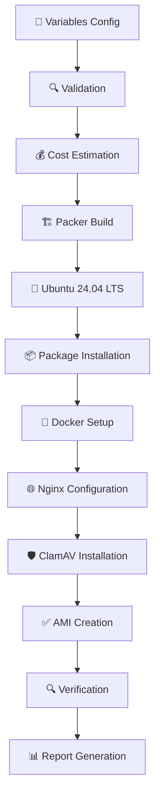

# 🎯 Production-Ready Ubuntu 24.04 LTS AMI Builder

<div align="center">


**🚀 Professional AWS AMI Builder with Complete CI/CD Pipeline**

*Automated • Cost-Optimized • Production-Ready • Secure*

</div>

---

## 📖 Table of Contents

- [✨ Features](#-features)
- [🏗️ Architecture](#️-architecture)
- [⚡ Quick Start](#-quick-start)
- [🔧 Configuration](#-configuration)
- [🏃‍♂️ Running Builds](#️-running-builds)
- [🔄 CI/CD Pipeline](#-cicd-pipeline)
- [💰 Cost Analysis](#-cost-analysis)
- [🧪 Testing](#-testing)
- [📁 Project Structure](#-project-structure)
- [🛡️ Security](#️-security)
- [🐛 Troubleshooting](#-troubleshooting)
- [🤝 Contributing](#-contributing)

---

## ✨ Features

### 🎯 **Core Capabilities**
- 🐧 **Ubuntu 24.04 LTS** - Latest stable base image
- 🐳 **Docker CE + Compose** - Container runtime ready
- 🌐 **Nginx** - Production web server
- 🛡️ **ClamAV** - Integrated antivirus protection
- 🔧 **Development Tools** - Essential packages included

### 🚀 **Professional Features**
- 📊 **Cost Optimization** - t3.small instance (only $0.12-$0.22 per build)
- 🔄 **GitLab CI/CD** - Fully automated pipeline
- 🧪 **Local Testing** - Dry-run capabilities
- 📈 **Build Reporting** - Comprehensive logs and metrics
- ⚙️ **Configurable** - Flexible variable system

### 🛡️ **Security & Reliability**
- 🔐 **Secure Credential Management** - AWS IAM integration
- ✅ **Template Validation** - Pre-build verification
- 📋 **Comprehensive Logging** - Full audit trail
- 🎯 **Production Tested** - Battle-tested configurations

---

## 🏗️ Architecture



### 📦 Software Stack

| Component | Version | Purpose |
|-----------|---------|----------|
| 🐧 **Ubuntu** | 24.04 LTS | Base Operating System |
| 🐳 **Docker** | Latest CE | Container Runtime |
| 🌐 **Nginx** | Latest | Web Server |
| 🛡️ **ClamAV** | Latest | Antivirus Protection |
| 🐍 **Python** | 3.x | Scripting & Development |
| 📦 **Node.js** | Latest LTS | JavaScript Runtime |
| 🔧 **Essential Tools** | Various | git, curl, wget, vim, htop |

---

## ⚡ Quick Start

### 1️⃣ **Clone Repository**
```bash
git clone ssh://git@gitlab.com/pdelpino/packer-ami-generator-v1.git
cd packer-ami-generator-v1
```

### 2️⃣ **Install Prerequisites**
```bash
# Install Packer
wget https://releases.hashicorp.com/packer/1.14.0/packer_1.14.0_linux_amd64.zip
unzip packer_1.14.0_linux_amd64.zip
sudo mv packer /usr/local/bin/

# Install AWS CLI
curl "https://awscli.amazonaws.com/awscli-exe-linux-x86_64.zip" -o "awscliv2.zip"
unzip awscliv2.zip
sudo ./aws/install
```

### 3️⃣ **Configure AWS Credentials**
```bash
aws configure
# Enter your AWS Access Key ID, Secret Access Key, and preferred region
```

### 4️⃣ **Customize Configuration**
```bash
cp variables.pkrvars.hcl my-variables.pkrvars.hcl
# Edit my-variables.pkrvars.hcl with your preferences
```

### 5️⃣ **Build AMI**
```bash
# Validate configuration
packer validate -var-file="variables.pkrvars.hcl" packer.pkr.hcl

# Build AMI
packer build -var-file="variables.pkrvars.hcl" packer.pkr.hcl
```

---

## 🔧 Configuration

### 📋 **Main Configuration File**

**`variables.pkrvars.hcl`** - Primary configuration file

```hcl
# AWS Configuration
aws_region = "us-east-1"

# Instance Configuration (Cost-Optimized)
instance_type = "t3.small"  # ~$0.0208/hour

# AMI Configuration
ami_name_prefix = "ubuntu-custom"
root_volume_size = 20

# Software Packages
essential_packages = ["curl", "clamav", "vim", "git"]
additional_packages = ["wget", "htop", "nginx", "python3"]
```

### 💰 **Cost Optimization Settings**

| Instance Type | Cost/Hour | Build Cost | Use Case |
|---------------|-----------|------------|----------|
| t3.nano | $0.0052 | $0.03-$0.04 | Minimal builds |
| **t3.small** ⭐ | **$0.0208** | **$0.12-$0.22** | **Recommended** |
| t3.medium | $0.0416 | $0.22-$0.43 | Heavy workloads |

### 🎛️ **Package Configurations**

<details>
<summary>📦 <strong>Minimal Package Set</strong></summary>

```hcl
essential_packages = ["curl", "vim", "git"]
additional_packages = ["wget", "htop"]
```
*Estimated build time: 10-15 minutes*
</details>

<details>
<summary>🚀 <strong>Development Package Set</strong></summary>

```hcl
essential_packages = ["curl", "clamav", "vim", "git", "nano"]
additional_packages = [
  "wget", "htop", "unzip", "zip", "tree", "jq",
  "build-essential", "python3", "python3-pip",
  "nodejs", "npm", "nginx", "docker.io"
]
```
*Estimated build time: 20-30 minutes*
</details>

---

## 🏃‍♂️ Running Builds

### 🖥️ **Local Build**
```bash
# Quick validation
packer validate -var-file="variables.pkrvars.hcl" packer.pkr.hcl

# Full build with logging
packer build -var-file="variables.pkrvars.hcl" packer.pkr.hcl | tee build.log
```

### 🧪 **Dry Run Testing**
```powershell
# Test pipeline without AWS costs
.\test-pipeline-simple.ps1
```

### 📊 **Build Monitoring**
```bash
# Monitor build progress
tail -f build.log | grep -E "(==>|\s+\w+:)"
```

---

## 🔄 CI/CD Pipeline

### 🚀 **GitLab CI Pipeline Stages**

```yaml
# .gitlab-ci.yml
stages:
  - validate      # ✅ Template validation
  - cost-estimate # 💰 Cost calculation
  - build         # 🏗️ AMI creation (manual)
  - verify        # 🔍 AMI verification
  - report        # 📊 Build reporting
```

### 📈 **Pipeline Features**

| Stage | Duration | Purpose |
|-------|----------|----------|
| 🔍 **Validate** | ~30s | Template syntax check |
| 💰 **Cost Estimate** | ~10s | Build cost prediction |
| 🏗️ **Build** | 15-30min | AMI creation (manual trigger) |
| ✅ **Verify** | ~30s | AMI availability check |
| 📊 **Report** | ~10s | Comprehensive build report |

### 🎮 **Manual Triggers**
The build stage requires manual approval for cost control:
1. Navigate to **CI/CD > Pipelines** in GitLab
2. Click ▶️ **Manual** on the build stage
3. Monitor progress in real-time

---

## 💰 Cost Analysis

### 📊 **Real Build Costs**

```
💵 ACTUAL BUILD COST BREAKDOWN
═══════════════════════════════
📦 Instance: t3.small @ $0.0208/hour
⏱️  Duration: ~25 minutes
💾 Storage: ~$0.01 (temporary)
🌐 Data Transfer: Minimal
═══════════════════════════════
💰 TOTAL: ~$0.15 per build
```

### 📈 **Cost Optimization Tips**
- ✅ Use **t3.small** for best price/performance
- ✅ Build during off-peak hours
- ✅ Use manual triggers to control frequency
- ✅ Leverage GitLab's cost estimation stage

---

## 🧪 Testing

### 🖥️ **Local Testing Script**

```powershell
# Dynamic cost calculation based on your config
.\test-pipeline-simple.ps1

# Test specific stage
.\test-pipeline-simple.ps1 -Stage validate
```

### 📋 **Test Coverage**
- ✅ Packer installation verification
- ✅ Template syntax validation
- ✅ AWS credentials check
- ✅ Dynamic cost calculation
- ✅ Build simulation
- ✅ Pipeline stage verification

---

## 📁 Project Structure

```
packer-ami-generator-v1/
├── 📄 packer.pkr.hcl           # Main Packer template
├── ⚙️  variables.pkrvars.hcl    # Configuration variables
├── 🔄 .gitlab-ci.yml           # CI/CD pipeline
├── 📂 ansible/
│   └── 📜 playbook.yml         # Software provisioning
├── 🧪 test-pipeline-simple.ps1 # Local testing script
├── 📊 gitlab-task-template.md  # Project documentation
├── 📚 README.md               # This file
└── 📄 .gitignore              # Version control exclusions
```

---

## 🛡️ Security

### 🔐 **Security Features**
- 🛡️ **ClamAV Antivirus** - Real-time protection
- 🔒 **AWS IAM Integration** - Secure credential management
- 🔐 **No Hardcoded Secrets** - Environment variable usage
- 📋 **Audit Logging** - Complete build traceability
- ✅ **Template Validation** - Pre-build security checks

### 🔒 **Best Practices**
```bash
# Use IAM roles instead of access keys (recommended)
aws sts assume-role --role-arn arn:aws:iam::ACCOUNT:role/PackerRole

# Rotate credentials regularly
aws iam rotate-access-key
```

---

## 🐛 Troubleshooting

### ❌ **Common Issues**

<details>
<summary>🔍 <strong>Packer Validation Fails</strong></summary>

**Problem**: Template validation errors

**Solution**:
```bash
# Check Packer version
packer version

# Validate with verbose output
packer validate -var-file="variables.pkrvars.hcl" packer.pkr.hcl
```
</details>

<details>
<summary>🔑 <strong>AWS Credential Errors</strong></summary>

**Problem**: Authentication failures

**Solution**:
```bash
# Verify credentials
aws sts get-caller-identity

# Check permissions
aws iam get-user
```
</details>

<details>
<summary>💰 <strong>Unexpected Costs</strong></summary>

**Problem**: Higher than expected AWS charges

**Solution**:
- Use the dry-run script first: `./test-pipeline-simple.ps1`
- Monitor builds in AWS Console
- Set up billing alerts
</details>

### 📞 **Support**
- 📚 Check the [GitLab Issues](https://gitlab.com/pdelpino/packer-ami-generator-v1/-/issues)
- 📧 Review build logs in GitLab CI
- 🧪 Use the testing script for diagnostics

---

## 🤝 Contributing

### 🎯 **How to Contribute**
1. 🍴 Fork the repository
2. 🌿 Create a feature branch
3. 🧪 Test your changes with `test-pipeline-simple.ps1`
4. 📝 Update documentation
5. 🚀 Submit a merge request

### 📋 **Development Setup**
```bash
# Clone your fork
git clone https://gitlab.com/YOUR-USERNAME/packer-ami-generator-v1.git

# Install development dependencies
packer version  # Ensure Packer is installed
aws --version   # Ensure AWS CLI is installed

# Run tests
./test-pipeline-simple.ps1
```

---

<div align="center">

## 🎉 **Success!** 🎉

**You now have a production-ready, cost-optimized AWS AMI builder!**

[](#)
[](#)
[](#)

---

⭐ **Star this repo if it helped you!** ⭐

</div>
